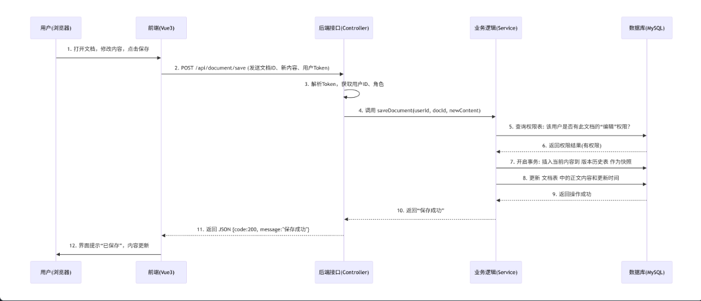
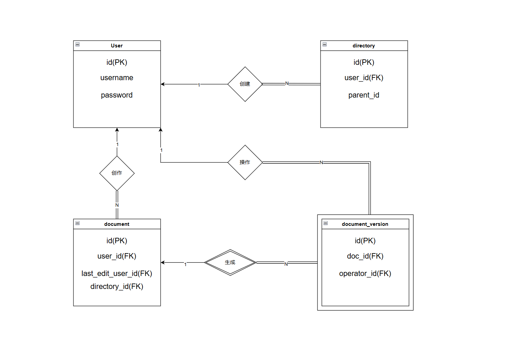
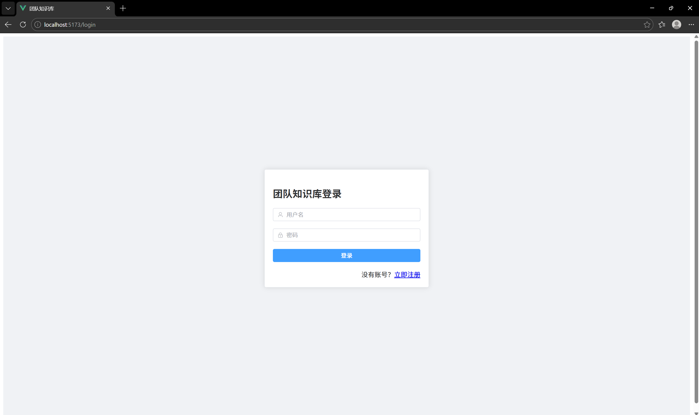
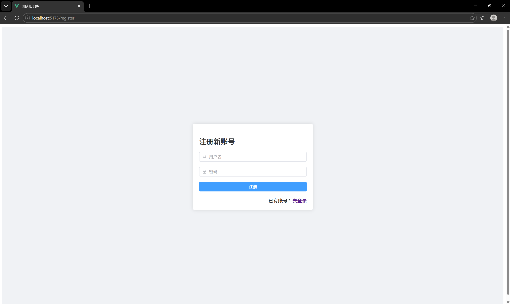
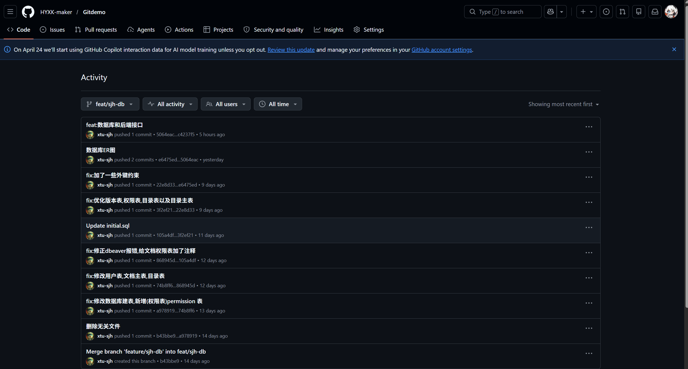
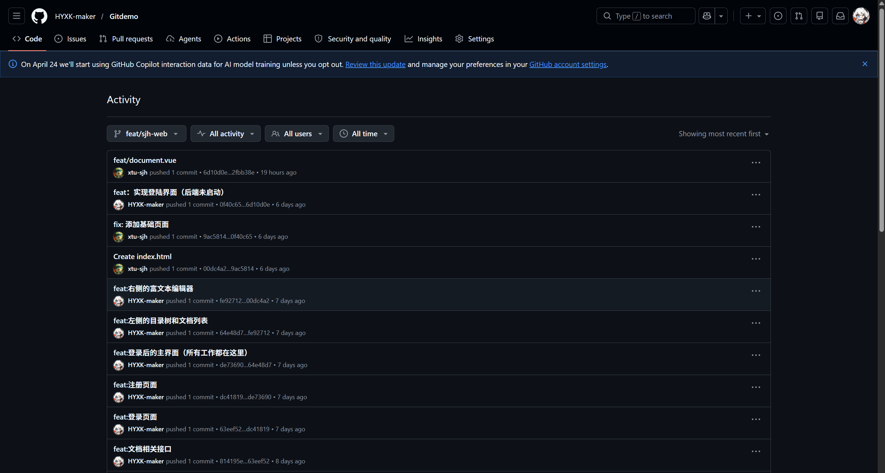
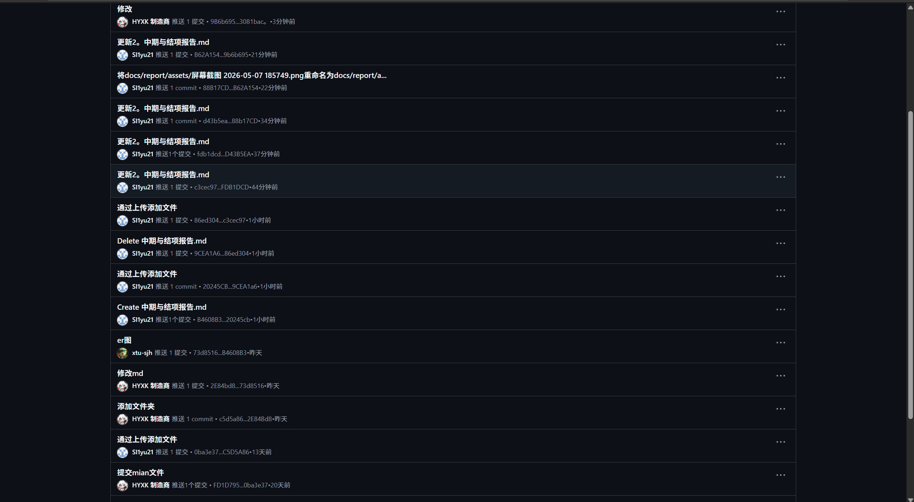
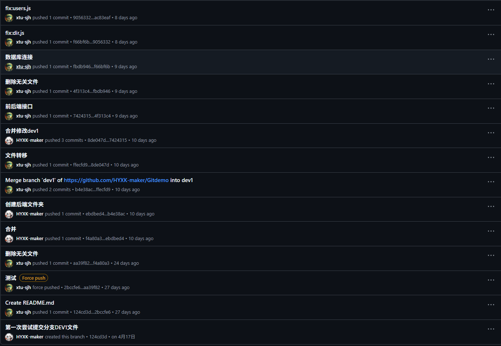
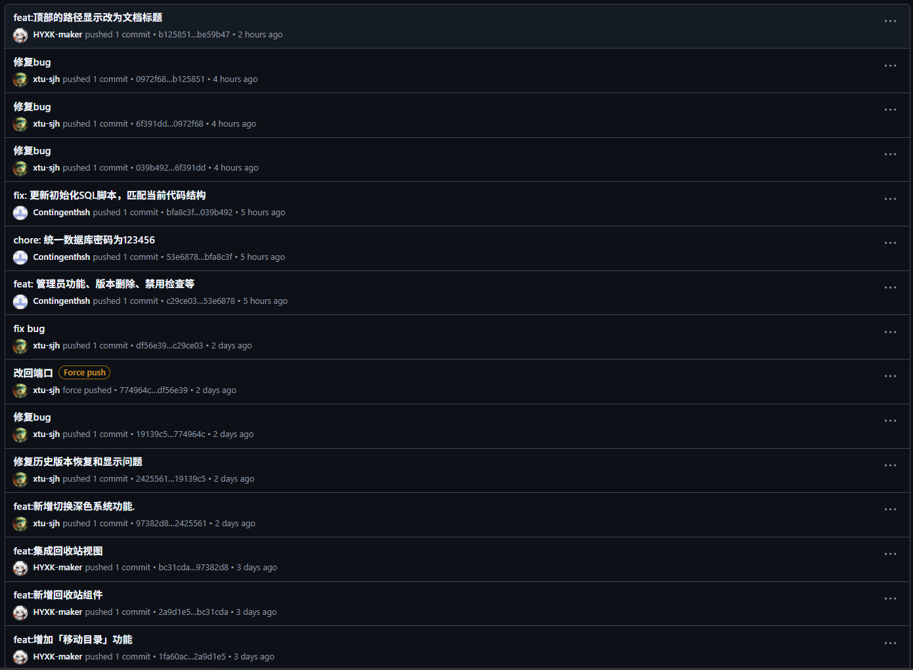

### 项目名称：轻量级团队协同文档知识库系统

**学 院：** 计算机学院
**小组序号：** 45
**成员姓名：** 哈思瀚，许浩，孙佳豪，史林瑞
**指导老师：** 尹兆远
**当前版本：** 结项版
**更新日期：** 2026年5月7日

---

### 一、项目概述

#### 1. 项目背景
本项目源于课程小组、班级、社团等小型团队在实际文档管理中的痛点。大家普遍遇到文档存放零散、版本混乱、协作不畅、权限不清等问题，导致查阅和共享文档费时费力。为改善这些情况，我们决定开发一套轻量级的团队协同文档知识库系统，实现文档的集中管理、在线编辑、版本追溯和权限控制。这不仅解决了实际问题，也让我们把课堂上学到的理论知识真正用了起来，锻炼了团队开发的能力。

#### 2. 系统目标
我们希望打造一个轻便、易用、适配性强的文档知识库系统，核心目标包括：
- 支持用户注册登录、身份验证和角色区分，保障系统访问安全；
- 实现多级目录管理和文档的增删改查，方便文档的分类存储与整理；
- 提供富文本在线编辑和自动保存功能，支持历史版本追溯与回滚；
- 实现细粒度的权限管控，区分不同用户对目录和文档的查看、编辑权限；
- 搭建简洁直观的界面，降低使用门槛，贴合学生用户的操作习惯；
- 完成前后端协同开发与系统测试，确保系统稳定流畅，达到课程设计的实践考核要求。

#### 3. 开发环境
- **开发工具**：前端（VS Code）、后端（IntelliJ IDEA）、数据库管理（Navicat Premium）、版本控制（Git）；
- **运行环境**：操作系统（Windows 11、WSL、macOS）、JDK 1.8+、浏览器（Chrome/Edge 版本≥80）、Node.js（前端运行依赖）；
- **数据库**：MySQL 5.7/8.0（字符集utf8mb4）。

---

### 二、需求分析

#### 1. 功能需求
系统围绕团队文档协同管理来设计，核心功能清单和业务流程如下：

**（1）核心功能清单**

| 功能序号 | 功能名称         | 功能描述                                                     | 当前进度 |
| :------- | :--------------- | :----------------------------------------------------------- | :------- |
| 1        | 用户注册与登录   | 普通用户注册、密码设置；账号登录、身份验证；区分管理员和普通用户 | 已完成   |
| 2        | 多级目录管理     | 创建/删除目录、调整目录层级、目录重命名、移动                | 已完成   |
| 3        | 文档新建与保存   | 新建文档、选择保存路径、实时保存编辑内容                     | 已完成   |
| 4        | 文档编辑与修改   | 富文本编辑（文字、格式调整）；内容实时保存，避免丢失         | 已完成   |
| 5        | 文档历史版本管理 | 手动保存版本（含说明）、查看历史版本内容、版本回溯、删除版本 | 已完成   |
| 6        | 权限管控         | 用户数据隔离、管理员自我降级保护、未授权访问拦截             | 已完成   |
| 7        | 禁用用户登录     | 管理员可禁用违规用户，被禁用用户登录时提示“账号已禁用”       | 已完成   |
| 8        | 文档删除         | 删除无用文档/目录，删除前有二次确认                          | 已完成   |
| 9        | 权限分配与管理   | 给不同用户分配管理员或普通用户角色，管理员可管理用户列表、修改角色、禁用/删除 | 已完成   |
| 10       | 系统基础设置     | 界面主题切换（暗黑/明亮），保存用户操作习惯                  | 已完成   |

**（2）核心业务流程**
用户通过登录页面进入系统。管理员可以进行用户管理和权限分配，普通用户则可以创建目录、新建文档，使用富文本编辑器编写内容，系统会自动保存。用户通过左侧的目录树查看和管理自己（或有权限）的文档，也可查看文档的历史版本，随时恢复之前的版本。删除或修改文档和目录时，系统会弹出二次确认，防止误操作。顶部的搜索框可以快速筛选文档，提升查找效率。

#### 2. 非功能需求
**（1）性能要求**
- **响应性能**：打开文档、切换目录、保存内容、调取历史版本等核心操作的响应时间不超过1秒，不会出现明显卡顿。
- **加载性能**：单篇文档加载时间不超过3秒，调取历史版本不超过2秒，目录树的展开和折叠反应灵敏，SQL查询效率稳定。
- **稳定性**：系统连续运行72小时无崩溃、无闪退，MySQL数据实时同步，不会丢失或错乱。
- **并发性能**：支持50人同时在线操作，文档编辑、权限设置等操作顺畅，SQL事务处理正常。
- **数据处理**：支持存储1000篇以上文档及其历史版本，SQL的增删改查操作效率高，延迟在可接受范围。

**（2）安全要求**
- **数据安全**：MySQL数据库采用加密存储，用户密码、文档内容均进行加密处理；定期自动备份数据库，防止误操作或系统故障导致数据丢失，支持SQL备份与恢复。
- **操作安全**：删除、修改文档/目录、变更权限等关键操作都需二次确认，防止误操作；操作日志留存，关键操作记录可通过SQL查询追溯。
- **权限安全**：严格通过SQL查询校验用户权限，区分管理员和普通用户，禁止越权操作（例如普通用户无法修改管理员文档、不能执行SQL级别的核心数据表操作）。
- **隐私安全**：用户账号、密码加密存储，不泄露个人信息及文档内容；禁止非法访问MySQL数据库，防止数据泄露。

**（3）兼容性要求**
- **浏览器兼容**：支持Chrome、Edge、Firefox等主流浏览器（版本≥80），界面布局正常，文档编辑、SQL驱动加载无问题。
- **设备与系统兼容**：适配Windows 10/11、macOS系统，电脑和平板终端均可正常打开操作，MySQL在不同系统下运行稳定。
- **技术兼容性**：前端Vue框架与后端SpringBoot框架适配良好，SQL语句兼容MySQL 5.7/8.0版本，无语法冲突。
- **格式兼容**：文档可正常导出为常用格式（TXT、PDF），与课程要求的计划书、汇报材料格式适配；MySQL数据库导出的数据可正常查看、复用。

---

### 三、系统设计

#### 1. 系统架构
本系统采用前后端分离的架构，整体分为前端展示层、后端业务逻辑层和数据持久层，三层结构清晰，耦合度低，便于我们分组开发和后期维护。


- **前端展示层**：直接面向用户，包含登录注册、目录树导航、文档编辑器、版本查看、权限配置等界面。它通过浏览器发起网络请求，接收后端接口返回的数据，完成页面渲染和交互。
- **后端业务层**：提供统一的接口服务，负责接收前端请求，处理用户认证、权限校验、目录管理、文档操作、版本管理等核心业务逻辑。
- **数据持久层**：基于MySQL数据库，使用标准SQL语句完成数据的增删改查，持久化存储用户信息、目录数据、文档内容、历史版本及权限配置等，保障数据长期稳定保存。

#### 2. 模块设计
系统按功能划分为五大核心模块：
- **用户模块**：负责注册、登录、身份验证和角色管理，是整个系统安全访问的基础。
- **目录管理模块**：负责多级目录的创建、删除、重命名和移动，维护目录的上下级关系，实现文档的分类收纳。
- **文档管理模块**：负责文档的新建、保存、编辑、删除和搜索，集成了富文本编辑器，支撑核心的在线编辑和自动保存功能。
- **版本管理模块**：负责记录文档每次手动保存后的历史版本，提供版本查询、内容查看和回溯功能，确保编辑过程可追溯、误操作可恢复。
- **权限管理模块**：负责用户与目录、文档的权限绑定，区分管理员和普通用户两种角色，并实现基于角色的操作权限控制，防止越权。

各模块间的关联关系很明确：用户模块为其他所有模块提供身份和权限支撑；目录模块为文档模块提供分类存储的“容器”；文档模块和版本模块联动，实现内容与版本的同步管理；权限模块则贯穿所有模块，管控用户的一切操作权限。

#### 3. 数据库设计
**（1）E-R图**

我们完成了系统全量的ER图设计，梳理了五大核心实体及其关联关系。ER图明确了各实体的属性、主键、外键和约束规则，清晰展示了“用户-目录-文档-版本-权限”之间的一对多关系，为数据库的搭建提供了可靠依据。

**（2）主要数据表设计**
围绕业务逻辑，我们设计了4张核心数据表，均采用InnoDB存储引擎，支持事务处理和外键关联。具体设计如下：

**1. 用户表 (user)**

```sql
CREATE TABLE user (
    id INT PRIMARY KEY AUTO_INCREMENT COMMENT '用户ID（主键）',
    username VARCHAR(50) NOT NULL UNIQUE COMMENT '登录账号，唯一',
    password VARCHAR(100) NOT NULL COMMENT '加密存储的登录密码',
    nickname VARCHAR(50) DEFAULT '普通用户' COMMENT '用户昵称',
    contact VARCHAR(20) DEFAULT '' COMMENT '联系方式',
    role VARCHAR(20) DEFAULT 'user' COMMENT '用户角色，admin-管理员，user-普通用户',
    status TINYINT DEFAULT 1 COMMENT '账号状态，1-正常，0-禁用',
    create_time DATETIME DEFAULT CURRENT_TIMESTAMP COMMENT '创建时间',
    update_time DATETIME DEFAULT CURRENT_TIMESTAMP ON UPDATE CURRENT_TIMESTAMP COMMENT '更新时间'
) ENGINE=InnoDB DEFAULT CHARSET=utf8mb4 COMMENT='用户信息表';
```

**2. 文档目录表 (directory)**

```sql
CREATE TABLE directory (
    id INT PRIMARY KEY AUTO_INCREMENT COMMENT '目录ID（主键）',
    name VARCHAR(100) NOT NULL COMMENT '目录名称',
    parent_id INT DEFAULT 0 COMMENT '父目录ID，0表示根目录',
    user_id INT NOT NULL COMMENT '创建人ID，关联user表',
    sort INT DEFAULT 0 COMMENT '排序权重，用于调整目录显示顺序',
    path VARCHAR(255) DEFAULT '' COMMENT '目录路径，用于层级遍历',
    level INT DEFAULT 1 COMMENT '目录层级，根目录为1',
    is_delete TINYINT DEFAULT 0 COMMENT '删除状态，0-未删除，1-已删除',
    create_time DATETIME DEFAULT CURRENT_TIMESTAMP COMMENT '创建时间',
    update_time DATETIME DEFAULT CURRENT_TIMESTAMP ON UPDATE CURRENT_TIMESTAMP COMMENT '更新时间',
    FOREIGN KEY (user_id) REFERENCES user(id) COMMENT '关联用户表，创建人'
) ENGINE=InnoDB DEFAULT CHARSET=utf8mb4 COMMENT='文档目录表';
```


**3. 文档主表 (document)**

```sql
CREATE TABLE document (
    id INT PRIMARY KEY AUTO_INCREMENT COMMENT '文档ID（主键）',
    title VARCHAR(200) NOT NULL COMMENT '文档标题',
    content TEXT COMMENT '文档内容',
    dir_id INT NOT NULL COMMENT '所属目录ID，关联directory表',
    user_id INT NOT NULL COMMENT '创建人ID，关联user表',
    last_edit_user INT COMMENT '最后编辑人ID，关联user表',
    doc_type VARCHAR(20) DEFAULT 'rich_text' COMMENT '文档类型，rich_text-富文本，markdown-Markdown，table-表格',
    status TINYINT DEFAULT 1 COMMENT '文档状态，1-正常，0-禁用',
    is_delete TINYINT DEFAULT 0 COMMENT '删除状态，0-未删除，1-已删除',
    create_time DATETIME DEFAULT CURRENT_TIMESTAMP COMMENT '创建时间',
    update_time DATETIME DEFAULT CURRENT_TIMESTAMP ON UPDATE CURRENT_TIMESTAMP COMMENT '更新时间',
    FOREIGN KEY (dir_id) REFERENCES directory(id) COMMENT '关联目录表',
    FOREIGN KEY (user_id) REFERENCES user(id) COMMENT '关联创建人',
    FOREIGN KEY (last_edit_user) REFERENCES user(id) COMMENT '关联最后编辑人'
) ENGINE=InnoDB DEFAULT CHARSET=utf8mb4 COMMENT='文档主表';
```


**4. 文档版本表 (document_version)**

```sql
CREATE TABLE document_version (
    id INT PRIMARY KEY AUTO_INCREMENT COMMENT '版本ID（主键）',
    doc_id INT NOT NULL COMMENT '关联文档ID，关联document表',
    content TEXT COMMENT '该版本的文档内容',
    version_num INT NOT NULL COMMENT '版本号，自增',
    user_id INT NOT NULL COMMENT '操作人ID，关联user表',
    change_desc VARCHAR(255) DEFAULT '' COMMENT '变更说明',
    create_time DATETIME DEFAULT CURRENT_TIMESTAMP COMMENT '版本生成时间',
    FOREIGN KEY (doc_id) REFERENCES document(id) COMMENT '关联文档表',
    FOREIGN KEY (user_id) REFERENCES user(id) COMMENT '关联操作人',
    UNIQUE KEY (doc_id, version_num) COMMENT '文档ID+版本号唯一，避免重复版本'
) ENGINE=InnoDB DEFAULT CHARSET=utf8mb4 COMMENT='文档版本表';
```


---

### 四、系统实现

#### 1. 关键技术
我们选用的都是主流、轻量且上手快的技术栈，贴合课程设计要求。

**（1）前端关键技术**
-   **Vue3 + Vite**：前端框架与构建工具，实现组件化开发，开发效率和页面渲染性能都很高。
-   **Element Plus**：UI组件库，帮我们快速搭建出简洁规范的用户界面，像导航栏、目录树、表单这些常用组件。
-   **Quill**：富文本编辑器，提供了文本格式化、列表、引用、代码块等编辑功能，配合防抖策略实现自动保存。
-   **Pinia**：状态管理工具，统一管理用户的token、登录状态等全局数据，让组件间的数据共享变得简单。
-   **Axios**：请求工具，封装后实现请求和响应的拦截，统一处理接口请求、错误提示，并自动为每个请求带上token。
-   **Vue Router**：路由管理工具，实现页面跳转和未登录拦截，管控页面访问权限。

**（2）数据库关键技术**
-   **MySQL**：我们用的关系型数据库，支持标准SQL，数据持久化存储很稳定，完全适配我们小型团队的数据管理需求。
-   **索引优化**：为目录表、文档表里常被查询的字段（parent_id、dir_id、user_id）加了索引，查询效率明显提升。
-   **外键约束**：通过外键关联各数据表，保证了数据的一致性和关联性，方便数据溯源。
-   **字符集配置**：统一设置utf8mb4字符集，解决了特殊符号、表情符号可能出现的存储乱码问题。
-   **容错设计**：SQL脚本里加了`if not exists`判断，避免重复创建数据库和表，让脚本在多环境下都能顺利执行。

**（3）后端相关技术**
-   **核心框架**：Spring Boot 3.x 系列。
-   **持久层框架**：MyBatis-Plus 3.5.x 系列。
-   **数据库驱动**：MySQL Connector/J，版本与我们的MySQL服务器版本匹配。

**（4）技术难点解决方案**
-   **跨域问题**：开发时前后端端口不同，通过Vite的代理配置，把前端的/api请求代理到后端的8080端口，顺利解决了跨域交互问题。
-   **目录层级错乱**：优化了目录表parent_id的关联逻辑，增加了层级校验，确保移动或删除目录时，层级关系不会出错。
-   **文档内容乱码**：把数据库的字符集设为utf8mb4，并调整了后端接口的编码处理逻辑，富文本内容能正常存储和显示。
-   **接口格式不统一**：大家提前约定了JSON数据格式，写好了接口文档，联调时同步确认了参数定义，避免了互相阻塞。

#### 2. 界面展示
以下是系统核心页面的实际运行截图及说明。

（1）**登录页面**

*（此处插入登录界面截图，路径示例：./assets/denglu.png）*
**说明**：完成表单设计与校验，包含账号、密码输入框，登录按钮，注册跳转链接；实现表单验证（密码长度不低于6位），登录接口调用，登录成功后自动跳转至主界面。

（2）**注册页面**

*（此处插入注册界面截图，路径示例：./assets/zhuce.png）*
**说明**：包含账号、密码、确认密码输入框，注册按钮，登录跳转链接；实现表单校验，注册成功后自动跳转至登录页面，保障注册流程顺畅。

（3）**主界面（暗黑模式）**
*（此处插入主界面暗黑模式截图，路径示例：./assets/main-dark.png）*
**说明**：采用响应式布局，左侧为可折叠目录树，右侧为文档编辑器与版本面板，顶部为功能栏。支持一键切换暗黑/明亮主题，提供完整的文档协同编辑体验。

#### 3. 核心代码片段
**（1）前端路由守卫代码**
```javascript
// src/router/index.js
import { createRouter, createWebHistory } from 'vue-router'
import { useUserStore } from '@/stores/user'
import Login from '@/views/Login.vue'
import Register from '@/views/Register.vue'
import Main from '@/views/Main.vue'

const routes = [
  { path: '/', redirect: '/login' },
  { path: '/login', component: Login, name: 'Login' },
  { path: '/register', component: Register, name: 'Register' },
  { 
    path: '/main', 
    component: Main, 
    name: 'Main',
    meta: { requireAuth: true } // 需要登录才能访问
  }
]

const router = createRouter({
  history: createWebHistory(),
  routes
})

// 路由守卫：未登录拦截
router.beforeEach((to, from, next) => {
  const userStore = useUserStore()
  // 判断当前页面是否需要登录
  if (to.meta.requireAuth) {
    // 已登录则放行，未登录则跳转至登录页
    if (userStore.token) {
      next()
    } else {
      next('/login')
    }
  } else {
    next()
  }
})

export default router
```

**（2）Axios封装代码**

```javascript
// src/api/request.js
import axios from 'axios'
import { useUserStore } from '@/stores/user'

// 创建Axios实例
const request = axios.create({
  baseURL: import.meta.env.VITE_API_BASE_URL, // 统一基础路径
  timeout: 5000 // 超时时间
})

// 请求拦截器：自动携带token
request.interceptors.request.use(
  (config) => {
    const userStore = useUserStore()
    if (userStore.token) {
      config.headers.Authorization = `Bearer ${userStore.token}`
    }
    return config
  },
  (error) => {
    return Promise.reject(error)
  }
)

// 响应拦截器：统一错误处理、401未授权退出
request.interceptors.response.use(
  (response) => {
    // 成功响应，直接返回数据
    return response.data
  },
  (error) => {
    const userStore = useUserStore()
    // 401未授权，清除token并跳转至登录页
    if (error.response?.status === 401) {
      userStore.logout() // 清除token和用户信息
      window.location.href = '/login'
    }
    // 其他错误提示
    ElMessage.error(error.response?.data?.msg || '操作失败，请稍后再试')
    return Promise.reject(error)
  }
)

export default request
```

**（3）数据库核心表创建SQL代码**

```sql
-- 创建数据库（带容错判断）
CREATE DATABASE IF NOT EXISTS doc_system DEFAULT CHARACTER SET utf8mb4 COLLATE utf8mb4_unicode_ci;

-- 使用数据库
USE doc_system;

-- 创建用户表（核心代码片段，完整代码见第三章）
CREATE TABLE IF NOT EXISTS user (
    id INT PRIMARY KEY AUTO_INCREMENT COMMENT '用户ID（主键）',
    username VARCHAR(50) NOT NULL UNIQUE COMMENT '登录账号，唯一',
    password VARCHAR(100) NOT NULL COMMENT '加密存储的登录密码',
    role VARCHAR(20) DEFAULT 'user' COMMENT '用户角色，admin-管理员，user-普通用户',
    create_time DATETIME DEFAULT CURRENT_TIMESTAMP COMMENT '创建时间',
    update_time DATETIME DEFAULT CURRENT_TIMESTAMP ON UPDATE CURRENT_TIMESTAMP COMMENT '更新时间'
) ENGINE=InnoDB DEFAULT CHARSET=utf8mb4 COMMENT='用户信息表';
```

---

### 五、系统测试

#### 1. 测试方案
**（1）测试方法**
-   **单元测试**：针对每个模块的独立功能进行测试，比如前端的组件、后端的接口、SQL查询语句，确保单个功能运行正常。
-   **集成测试**：把前端、后端和数据库联合起来测试，验证各模块协同工作的正确性，重点测试接口联调和数据交互。
-   **功能测试**：对照需求文档，逐一测试系统10个核心功能是否实现，是否符合预期。
-   **性能测试**：测试系统的响应速度、加载性能、并发性能，看是否满足我们设定的性能要求。
-   **兼容性测试**：在不同浏览器、不同操作系统上跑系统，检查界面显示和功能操作是否正常。

**（2）测试范围**
-   **前端模块**：登录/注册、目录管理、文档编辑、路由跳转、状态管理、接口调用等。
-   **数据库模块**：数据表创建、SQL查询/插入/修改/删除操作、数据关联、索引效率、数据备份与恢复。
-   **核心功能**：用户认证、目录操作、文档操作、权限控制、版本管理。
-   **非功能测试**：性能、安全、兼容性测试。

**（3）测试思路**
在开发中期，我们先完成了单元测试和前端功能测试，验证了已完成模块的正确性。后端接口开发完成后，立刻展开了集成测试。我们制定了详细的测试用例，明确了每个功能的测试要点和预期结果。进入结项阶段后，我们进行了全量测试，记录了所有结果，并对发现的BUG进行了修复，最终确保了系统的稳定性和流畅性。

**（4）测试用例及结果**

| 测试用例ID | 测试模块            | 测试内容                             | 预期结果                                 | 测试结果 |
| :--------- | :------------------ | :----------------------------------- | :--------------------------------------- | :------- |
| TC001      | 用户模块-注册       | 输入合法账号、密码（≥6位），点击注册 | 注册成功，跳转登录页，数据库新增记录     | 通过     |
| TC002      | 用户模块-登录       | 输入正确账号、密码，点击登录         | 登录成功，跳转主界面，存储token          | 通过     |
| TC003      | 用户模块-禁用登录   | 管理员禁用某用户，该用户尝试登录     | 登录失败，提示“账号已被禁用”             | 通过     |
| TC004      | 目录模块-创建目录   | 点击新建目录，输入名称               | 目录创建成功，目录树显示新目录           | 通过     |
| TC005      | 目录模块-重命名     | 右键目录，选择重命名，输入新名称     | 目录名称更新成功                         | 通过     |
| TC006      | 目录模块-删除       | 右键目录，选择删除                   | 弹出确认框，确认后目录消失               | 通过     |
| TC007      | 文档模块-新建文档   | 点击新建文档，输入标题，编辑内容     | 文档创建成功，自动保存                   | 通过     |
| TC008      | 文档模块-编辑保存   | 修改文档内容，等待2秒                | 状态变为“已保存”，数据库内容更新         | 通过     |
| TC009      | 文档模块-版本保存   | 点击保存版本，输入说明               | 版本列表新增记录，显示版本说明           | 通过     |
| TC010      | 文档模块-版本恢复   | 点击某历史版本，选择恢复             | 编辑器加载该版本内容                     | 通过     |
| TC011      | 文档模块-版本删除   | 点击版本右侧删除按钮                 | 确认后版本消失，列表刷新                 | 通过     |
| TC012      | 权限模块-用户隔离   | 用户A登录，查看目录树                | 仅显示用户A创建的目录和文档              | 通过     |
| TC013      | 权限模块-管理员列表 | 管理员登录，进入用户管理             | 显示所有用户（不含自身），角色中文显示   | 通过     |
| TC014      | 权限模块-修改角色   | 管理员提升普通用户为管理员           | 角色更新成功，列表刷新                   | 通过     |
| TC015      | 权限模块-自我降级   | 管理员将自己降为普通用户             | 提示警告，强制退出，重新登录后无管理权限 | 通过     |
| TC016      | 系统设置-主题切换   | 点击主题切换按钮                     | 界面在暗黑/明亮模式间切换                | 通过     |
| TC017      | 数据库-初始化脚本   | 执行 initial.sql                     | 自动建库建表，插入默认管理员             | 通过     |
| TC018      | 数据库-数据完整性   | 完成各操作后查询数据库               | 各表记录正确，关联一致，无乱码           | 通过     |
| TC019      | 安全-未授权访问     | 普通用户直接访问 /admin              | 自动跳转到主界面                         | 通过     |
| TC020      | 安全-API权限        | 普通用户调用管理员API                | 返回403无权限                            | 通过     |

#### 2. 问题与改进
| 序号 | 问题描述                                | 改进措施                                                  | 改进效果                   |
| :--- | :-------------------------------------- | :-------------------------------------------------------- | :------------------------- |
| 1    | MySQL密码不一致，导致后端无法连接数据库 | 统一配置密码为123456，并修改本地MySQL密码与之匹配         | 后端正常启动，数据读写正常 |
| 2    | 登录不存在的用户时返回500错误           | 后端捕获异常，返回友好提示“用户不存在”                    | 用户看到明确错误信息       |
| 3    | 版本说明无法显示                        | 开启MyBatis驼峰映射（map-underscore-to-camel-case: true） | 版本说明正常显示           |
| 4    | 删除用户时外键约束报错                  | 修改document_version表外键，添加ON DELETE SET NULL        | 删除用户成功               |
| 5    | 管理员可降级/删除自己                   | 后端过滤管理员自身，前端检测自我降级并强制退出            | 管理员安全受保护           |
| 6    | 前端因WSL路径问题无法启动               | 在WSL内安装Linux版Node.js，使用原生路径                   | 前端正常启动               |
| 7    | 队友提交导致本地密码被覆盖              | 统一将密码改为123456并推送                                | 密码统一，不再冲突         |

---

### 六、用户手册

#### 1. 安装部署说明
**1.1 环境要求**
| 环境     | 版本要求                                   |
| :------- | :----------------------------------------- |
| 操作系统 | Windows 10/11 + WSL2（Ubuntu 20.04/22.04） |
| Java     | JDK 17+                                    |
| Maven    | 3.6+                                       |
| Node.js  | v20.19.0+                                  |
| MySQL    | 8.0+                                       |
| 浏览器   | Chrome 90+ / Edge 90+                      |

**1.2 克隆项目**
```bash
git clone -b dev1 https://github.com/HYXK-maker/Gitdemo.git
cd Gitdemo
```

**1.3 数据库部署**
**步骤1：确保 MySQL 服务已启动**


```bash
sudo service mysql status
# 如果未运行，执行：
sudo service mysql start
```


**步骤2：设置 MySQL root 密码为 123456**


```bash
# 如果密码不是123456，用sudo免密登录后修改
sudo mysql
```


在 MySQL 命令行中执行：


```sql
ALTER USER 'root'@'localhost' IDENTIFIED WITH mysql_native_password BY '123456';
FLUSH PRIVILEGES;
EXIT;
```


**步骤3：导入初始化脚本**


```bash
mysql -u root -p123456 < dev1/sql/DB/sql/initial.sql
```


执行后自动完成：创建数据库 doc_system、创建4张核心表、插入默认管理员账号。

**1.4 后端项目启动**
打开三个终端窗口，分别执行：

**终端1：启动知识库后端（8080端口）**


```bash
cd Gitdemo/dev1/src/Backend/knowledge-base-backend
mvn clean package -DskipTests
mvn spring-boot:run
```


**终端2：启动代理后端（8081端口）**


```bash
cd Gitdemo/dev1/src/Backend/backend
mvn clean package -DskipTests
mvn spring-boot:run
```


启动成功标志：终端出现 `Started DemoApplication in ...` 和 `Started KnowledgeBaseBackendApplication in ...`。

**1.5 前端项目启动**
**终端3：启动前端（3000端口）**


```bash
cd Gitdemo/dev1/src/Web/knowledge-base-frontend
npm install
npx vite --port 3000 --host
```


启动成功标志：终端出现 `VITE v8.0.12 ready in ...` 及本地访问地址。

**1.6 访问系统**
打开浏览器，访问：


```text
http://localhost:3000
```


**1.7 默认管理员账号**

| 用户名 | 密码   | 角色   |
| :----- | :----- | :----- |
| admin  | 123456 | 管理员 |

首次登录后建议修改密码。如需更多管理员，可注册新用户后在数据库中将其 `role` 改为 `admin`。

#### 2. 操作指南

**2.1 用户注册与登录**

- **注册新账号**：访问`http://localhost:3000`，点击“立即注册”，输入用户名和密码（密码需≥6位），点击注册。注册成功后会自动跳转登录页。
- **登录系统**：输入用户名和密码，点击“登录”，成功后进入主界面。右上角会显示当前用户名。

**2.2 多级目录管理**

- **创建目录**：点击左侧的“+ 新建目录”按钮，输入目录名称，点击确定，目录树中就会出现新目录。
- **重命名目录**：右键点击目录，选择“重命名”，输入新名称后点击确定。
- **删除目录**：右键点击目录，选择“删除”，在确认弹窗中点击确定。目录和其下的所有内容都会被删除。

**2.3 文档新建与编辑**

- **新建文档**：点击“+ 新建文档”按钮，或在目录上右键选择“新建文档”，输入文档标题后确定。文档会出现在目录树中，右侧也会自动打开编辑器。
- **编辑文档**：点击目录树中的文档，右侧就会加载内容。使用富文本编辑器就可以进行编辑（支持文字和格式调整）。修改内容后，右上角状态会变成“未保存...”，2秒后自动保存为“已保存”。
- **修改标题**：点击编辑器顶部的标题区域，直接修改后按回车或点击其他地方，就会自动保存。

**2.4 文档历史版本管理**

- **保存版本**：编辑文档后，点击编辑器工具栏的“保存版本”按钮，输入版本说明（可选），点击确定。右侧的版本面板就会出现新记录。
- **查看和恢复版本**：在右侧版本面板中点击某个版本，弹窗会显示完整内容。点击“恢复此版本”，编辑器就会加载该版本内容。
- **删除版本**：在版本面板中，点击版本右侧的“删除”按钮，确认后该版本就会被删除。

**2.5 管理员功能**

- **进入用户管理**：使用管理员账号登录后，点击右上角用户名 -> “用户管理”。
- **查看用户列表**：列表里会显示所有普通用户，不显示管理员自身。角色会显示为“管理员”或“普通用户”，状态显示为“正常”或“禁用”。
- **修改用户角色**：点击“提升为管理”可以把普通用户提升为管理员；点击“降为普通”则反向操作。*注意：如果管理员把自己降级了，系统会强制退出。*
- **禁用/启用用户**：点击“禁用”，该用户就无法登录了；点击“启用”则恢复登录权限。
- **删除用户**：点击“删除”，确认后即可移除该用户。

**2.6 主题切换**
点击页面顶部右侧的月亮/太阳按钮，界面就会在暗黑模式和明亮模式之间切换，即时生效，无需刷新。

**2.7 用户数据隔离**
每个用户只能看到自己创建的目录和文档，不同用户之间的数据互不可见。管理员也无法直接查看其他用户的文档内容。

**2.8 数据初始化**
系统提供了 `initial.sql` 脚本，可以一键初始化数据库。它包含了完整的表结构和默认管理员账号，无论是首次部署还是想重置环境，都很方便。

---

### 七、项目总结

#### 1. 成果总结
**1.1 结项最终成果总结**
经过团队协作，项目已全面完成，最终成果如下：

**（1）功能实现情况**
系统10项核心功能全部实现，具体如下：

| 功能序号 | 功能名称         | 实现情况                                                     |
| :------- | :--------------- | :----------------------------------------------------------- |
| 1        | 用户注册与登录   | 支持注册、登录、token管理，可区分管理员/普通用户，并有友好的错误提示 |
| 2        | 多级目录管理     | 支持创建/删除/重命名目录，可实现无限层级树形结构，并配有右键菜单 |
| 3        | 文档新建与编辑   | 支持新建文档、选择保存目录，集成了富文本编辑器并实现实时自动保存 |
| 4        | 文档编辑与修改   | 支持富文本编辑（文字、格式调整）、标题修改和内容自动同步     |
| 5        | 文档历史版本管理 | 支持手动保存版本（含说明）、查看/恢复/删除任意历史版本       |
| 6        | 权限管控         | 实现了用户数据隔离、管理员自我降级保护和未授权访问拦截       |
| 7        | 禁用用户登录     | 管理员可禁用违规用户，被禁用户登录时会提示“账号已被禁用”     |
| 8        | 文档删除与恢复   | 支持删除文档/目录，并设有二次确认防止误删                    |
| 9        | 权限分配与管理   | 管理员可查看用户列表、修改角色（管理员/普通）、禁用/启用、删除用户 |
| 10       | 系统基础设置     | 支持暗黑/明亮主题切换，并提供一键初始化SQL脚本               |

**（2）成果物清单**
| 类别 | 成果物             | 说明                                  |
| :--- | :----------------- | :------------------------------------ |
| 文档 | 项目计划书         | 项目背景、目标、进度安排              |
| 文档 | 软件说明书         | 需求分析、功能设计、技术架构          |
| 文档 | 用户手册           | 安装部署说明、操作指南                |
| 文档 | 测试报告           | 20条测试用例，通过率100%              |
| 代码 | 前端项目           | Vue 3 + Vite + Element Plus + Quill   |
| 代码 | 后端项目（双服务） | Spring Boot + MyBatis + MySQL         |
| 代码 | 数据库脚本         | initial.sql（4张核心表 + 默认管理员） |
| 代码 | GitHub仓库         | dev1分支，含完整提交历史              |

**（3）系统运行效果**
-   采用前后端分离架构，双后端服务分工明确，分别负责核心业务和请求转发。
-   前端通过Vite代理实现跨域请求，开发和生产环境都可顺畅运行。
-   系统支持多用户同时在线使用，数据完全隔离。
-   管理员可通过后台集中管理用户权限。
-   富文本编辑器提供了流畅的文档编写体验。
-   版本历史功能实现了文档的版本化管理，方便追溯和恢复。
-   暗黑/明亮主题切换满足了不同用户的视觉偏好。

**（4）最终进度**
项目规划的10项功能已全部完成，前后端联调顺利通过，全部20条测试用例均测试通过，系统可以正常运行和部署。

#### 2. 不足与改进方向
**结项阶段最终不足与改进方向**
1.  **全文搜索功能未实现**：前端搜索框目前仅支持在前端进行过滤，没有实现后端的关键词全文检索。后续可以引入Elasticsearch或利用MySQL的全文索引，来实现高效的文档内容检索。
2.  **回收站功能暂时隐藏**：回收站功能的代码其实已经开发完成，但因为团队分工和协调的问题，暂时没有开放入口。后续版本可以考虑重新启用，实现文档/目录的软删除和恢复。
3.  **数据库初始化脚本需与代码保持同步**：`initial.sql`和我们最终调整过的代码结构不完全匹配，个别字段默认值需要手动修改。这个问题我们已经修正并推送到了GitHub，后续维护中需要特别注意保持脚本和代码的一致性。
4.  **权限管理粒度较粗**：目前的权限控制主要基于用户级数据隔离和角色管理，还不支持文档或目录级别的细粒度权限设置（比如指定某篇文档对某个用户可读或可写）。后续可以考虑引入成熟的RBAC权限模型，实现更独立的权限控制。
5.  **缺少自动化测试**：当前所有的测试都是手动功能测试，还没有编写自动化的单元测试和集成测试代码。后续可以引入JUnit、Selenium这类工具，把自动化测试体系建立起来。
6.  **性能优化还有空间**：系统目前还没进行过压力测试和性能调优，高并发下的表现还是未知数。后续可以增加缓存机制（如Redis）、优化数据库连接池、对前端代码进行分割等，来提升性能。

#### 3. 团队协作总结
整个开发过程，我们使用Git进行版本控制，主要在dev1分支上进行协作。前端由两名成员共同开发，后端和数据库也由团队成员分工完成。大家通过GitHub进行代码合并和冲突解决，整个过程很顺畅。

期间我们也遇到了一些技术难题，比如WSL环境的配置、MySQL密码的统一、MyBatis的驼峰映射问题、外键约束的处理等等，但最终都在团队成员的共同努力下解决了。

通过这个项目，我们都收获很大。每个人都实际经历了一个前后端分离项目从零到一的完整开发流程，熟练掌握了Vue 3 + Spring Boot + MySQL这套技术栈的整合运用，积累了宝贵的Git团队协作和冲突解决经验，数据库设计和SQL优化能力也得到了实打实的提升。

#### 4. 成员分工表
| 姓名   | 班级         | 学号         | Git 账号      | 承担任务                                                     |
| :----- | :----------- | :----------- | :------------ | :----------------------------------------------------------- |
| 哈思瀚 | 24级计科一班 | 202205820104 | Contingenthsh | 负责后端接口开发、业务逻辑实现，同时承担系统测试工作，排查后端BUG，配合前后端联调，保障系统稳定运行 |
| 许浩   | 24级计科一班 | 202405567005 | HYXK-maker    | 负责前端交互开发、核心功能实现与项目搭建，规范并维护GitHub仓库，保障前端代码规范与仓库管理有序 |
| 孙佳豪 | 24级计科一班 | 202405567035 | xtu-sjh       | 负责前端各类页面开发、页面样式优化，辅助完成数据库设计、SQL脚本编写与测试，配合数据库核心开发工作 |
| 史林瑞 | 24级计科一班 | 202405567030 | si1yu21       | 负责项目整体统筹、进度跟踪与协调，撰写项目各类文档（软件说明书、中期/结项报告等），同步团队开发进度 |

---
####5.Git 提交记录

中期阶段Git提交记录说明：已创建项目远程Git仓库，团队成员均已加入，前端开发成员、数据库开发成员已完成多次代码与文档提交，主要提交内容包括前端项目代码、数据库SQL脚本、ER图、项目计划书等；提交信息规范，均标注提交内容（如“feat: 完成登录页面开发”“docs: 完善数据库SQL脚本”），关键节点已打标签，可追溯开发过程。










### 附录
#### 参考资料
| 序号 | 参考资料                                                     | 用途说明                |
| :--- | :----------------------------------------------------------- | :---------------------- |
| 1    | Vue 3 官方文档（https://cn.vuejs.org）                       | 前端框架开发参考        |
| 2    | Vite 官方文档（https://cn.vitejs.dev）                       | 前端构建工具配置参考    |
| 3    | Element Plus 官方文档（https://element-plus.org）            | UI组件库使用参考        |
| 4    | Quill Editor 文档（https://vueup.github.io/vue-quill）       | 富文本编辑器集成参考    |
| 5    | Spring Boot 官方文档（https://spring.io/projects/spring-boot） | 后端框架开发参考        |
| 6    | MyBatis 官方文档（https://mybatis.org）                      | 数据库持久层框架参考    |
| 7    | MySQL 8.0 官方文档（https://dev.mysql.com/doc）              | 数据库设计与SQL语法参考 |
| 8    | Maven 官方文档（https://maven.apache.org）                   | 项目构建管理工具参考    |
| 9    | WSL 2 官方文档（https://learn.microsoft.com/zh-cn/windows/wsl） | 开发环境部署参考        |
| 10   | GitHub 官方文档（https://docs.github.com）                   | 版本控制与团队协作参考  |
| 11   | Node.js 官方文档（https://nodejs.org）                       | 前端运行环境参考        |
| 12   | npmmirror 镜像站（https://npmmirror.com）                    | npm依赖加速下载         |

#### 源代码仓库链接
🔗 项目仓库地址：https://github.com/HYXK-maker/Gitdemo

**仓库结构说明：**
| 目录                                    | 说明                                   |
| :-------------------------------------- | :------------------------------------- |
| dev1/src/Backend/backend                | 代理后端服务（8081端口，负责转发请求） |
| dev1/src/Backend/knowledge-base-backend | 知识库后端服务（8080端口，核心业务）   |
| dev1/src/Web/knowledge-base-frontend    | Vue 3前端项目                          |
| dev1/sql/DB/sql/initial.sql             | 数据库初始化脚本                       |
| dev1/docs/                              | 项目文档及图片资源                     |

**分支说明：**
- dev1：主开发分支，所有功能代码均在此分支
- 提交历史包含从项目初始化到最终功能完成的全部记录

#### 数据库表结构
系统共包含4张核心数据表：

| 表名             | 说明   | 关键字段                                       |
| :--------------- | :----- | :--------------------------------------------- |
| user             | 用户表 | id, username, password, role, status           |
| directory        | 目录表 | id, name, type, parent_id, user_id             |
| document         | 文档表 | id, title, content, directory_id, user_id      |
| document_version | 版本表 | id, doc_id, content, version_num, version_note |

#### 系统架构说明
-   前端：Vue 3 + Vite + Element Plus + Pinia + Vue Router
-   后端：Spring Boot双服务架构（8080核心业务 + 8081请求转发）
-   数据库：MySQL 8.0，通过MyBatis进行ORM映射
-   数据隔离：基于user_id的用户级数据隔离
-   权限控制：基于role字段的角色权限管理（admin/user）

#### 开发环境说明
本项目使用WSL 2（Windows Subsystem for Linux）作为开发环境，Ubuntu 22.04子系统，确保了Linux开发体验与Windows桌面环境的兼容。
